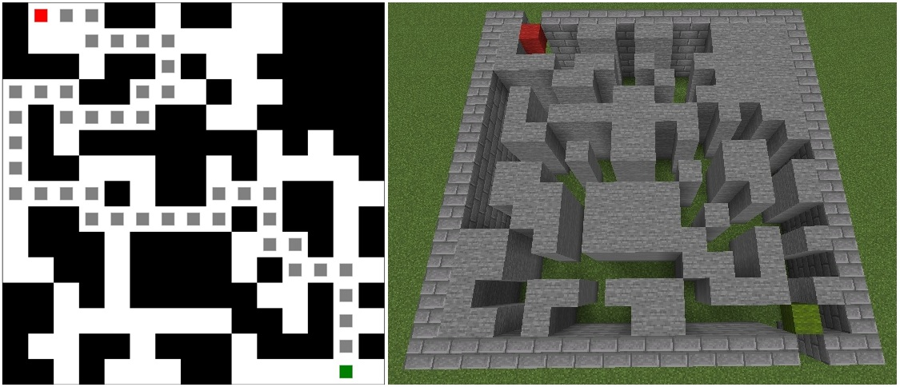

# Maze Generator for Minecraft

This tool generates 2D mazes (each cell being either a wall or an empty space). Mazes are rendered in a web browser and can be rendered in Minecraft for play. Maze generation is based on a genetic algorithm.

Two generation approaches are:
- **Gene Pool 1**: each gene is a tile (empty or wall)
- **Gene Pool 2**: each gene is a predefined structure

See examples of [generated mazes](#generated-mazes) and [predefined structures](#predefined-structures).

## Requirements
- Python 3
- python-dotenv
- requests
- nbtlib

Optional:
- Minecraft Java Edition
- GDMC HTTP Interface Mod

## Usage
- Install Python 3
- Then, run the generation:
```bash
git clone https://github.com/comtedavid92/Maze-Generator.git
cd Maze-Generator
python -m pip install -r requirements.txt
python MazeGenerator.py
```

Optional:
- Install Minecraft Java Edition
- Install [GDMC HTTP Interface Mod](https://github.com/Niels-NTG/gdmc_http_interface)

Minecraft maze rendering:
- Move your player to a sufficiently large and flat area  
- Make sure there are no objects around  
- Run the generation  
- Look around, the maze should have appeared near your position

## Settings

If you wish to adjust these settings, please create an `.env` file by copying `example.env`.

| Variable             | Type    | Default | Notes                                                                  |
| -------------------- | ------- | ------- | ---------------------------------------------------------------------- |
| METHOD_TO_USE        | int     | 1       | 1: Gene Pool 1, 2: Gene Pool 2                                         |
| MAZE_HEIGHT          | int     | 15      | Maze height in terms of tiles (maze must be square)                    |
| MAZE_WIDTH           | int     | 15      | Maze width in terms of tiles (maze must be square)                     |
| POPULATION_SIZE      | int     | 50      | Number of individuals of each generation                               |
| MAX_GENERATIONS      | int     | 200     | Number of generations to reach before stopping                         |
| REPLACE_UNREACHABLE  | boolean | true    | Replace unreachable tiles with wall tiles                              |
| RENDER_MINECRAFT     | boolean | false   | Render maze in Minecraft                                               |
| REWARD_START         | float   | 10.0    | Additional score when start is empty                                   |
| REWARD_END           | float   | 10.0    | Additionnal score when end is empty                                    |
| REWARD_CLOSE_PATH    | float   | 100.0   | Additionnal max score when path get closer (Manhattan distance) to end |
| REWARD_PATH          | float   | 1000.0  | Additionnal score when path is found (solvable maze)                   |
| REWARD_EXPL_EFFORT   | float   | 5.0     | Additionnal score multiplied by exploration effort (BFS)               |
| REWARD_WALLS         | float   | 2.5     | Additionnal score multiplied by number of wall tiles                   |
| REWARD_UNREACH_TILES | float   | -5.0    | Additionnal score multiplied by number of unreachable tiles            |
| REWARD_LOOPS         | float   | -10.0   | Additionnal score multiplied by number of revisited tiles              |

## Examples

### Generated mazes

#### Gene Pool 1



#### Gene Pool 2


### Player views

#### Player in front of the maze


#### Player in the maze


#### Player at the exit of the maze


## Predefined structures

<table>
    <tr>
        <td>STRUCT_CROSS<br></td>
        <td>STRUCT_VLINE<br></td>
        <td>STRUCT_HLINE<br></td>
        <td></td>
    </tr>
    <tr>
        <td>STRUCT_ELBOW_1<br></td>
        <td>STRUCT_ELBOW_2<br></td>
        <td>STRUCT_ELBOW_3<br></td>
        <td>STRUCT_ELBOW_4<br></td>
    </tr>
    <tr>
        <td>STRUCT_T_1<br></td>
        <td>STRUCT_T_2<br></td>
        <td>STRUCT_T_3<br></td>
        <td>STRUCT_T_4<br></td>
    </tr>
</table>

## Sources

### Papers

Generation using predefined structures: [Maze Generation Based on Difficulty using Genetic Algorithm with Gene Pool](https://ieeexplore.ieee.org/document/9234216).

Difficulty estimation using BFS: [Using Search Algorithm Statistics for Assessing Maze and Puzzle Difficulty](https://www.researchgate.net/publication/384602919_Using_Search_Algorithm_Statistics_for_Assessing_Maze_and_Puzzle_DifficultyLinks).

### ChatGPT

File `MazeGenerator.py`, function `genome_to_maze` with `USE_GENE_POOL_2` generated on 2025-08-15.

File `MazeGenerator.py`, function `replace_unreachable` generated on 2025-08-24.

File `MazeRenderer.py`, function `_get_surrounding_blocks` generated on 2025-08-27.

File `MazeGenerator.py`, function `load_parameters` generated on 2025-08-29.